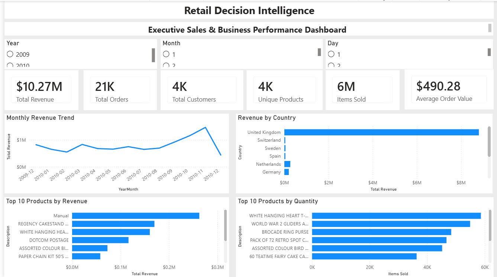
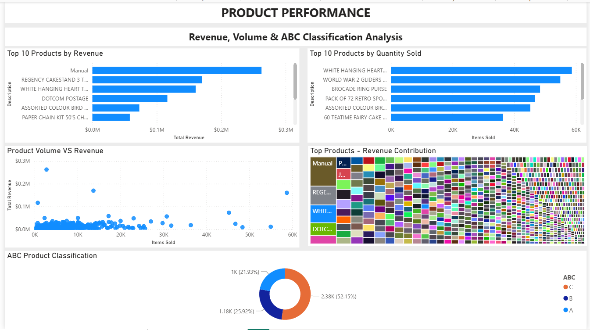
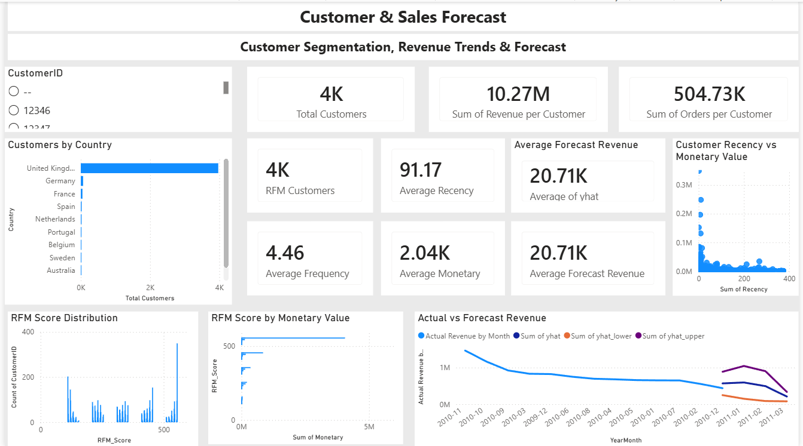

# Retail Decision Intelligence

### End-to-End Retail Sales Analytics, Customer Segmentation & Revenue Forecasting

## 📌 Project Overview

Retail Decision Intelligence is an end-to-end data analytics project built to transform retail transaction data into meaningful business insights.

The project follows a complete analytics workflow:

**Data Cleaning → SQL Analysis → Python EDA → Customer RFM Analysis → Sales Forecasting → Power BI Dashboard**

The objective is to help business stakeholders understand sales performance, product contribution, customer behavior, and future revenue trends.

---

## 📋 Business Problem

The detailed business problem and analytical objectives are documented separately in:

[Business Problem](Business_Problem.md)

## 🎯 Business Objectives

This project focuses on answering key business questions:

- How is revenue performing over time?
- Which countries contribute the most revenue?
- Which products generate the highest revenue?
- Which products have the highest sales volume?
- Which products are the most important according to ABC classification?
- What are the characteristics of high-value customers?
- How are customers distributed across RFM segments?
- What does the future revenue forecast indicate?

---

## 🛠️ Tools & Technologies

| Technology | Purpose |
|------------|---------|
| Python | Data cleaning, EDA, feature engineering and forecasting |
| Pandas | Data manipulation and analysis |
| NumPy | Numerical operations |
| Matplotlib | Data visualization |
| MySQL | SQL-based business analysis |
| Power BI | Interactive dashboard development |
| Git & GitHub | Version control and project management |
| Jupyter Notebook | Analysis and experimentation |

---

# 🔄 Project Workflow

```text
Raw Retail Dataset
        ↓
Data Understanding & Data Quality Assessment
        ↓
Data Cleaning
        ↓
Feature Engineering
        ↓
Exploratory Data Analysis
        ↓
SQL Business Analysis
        ↓
Product & Pareto Analysis
        ↓
Market Basket Analysis
        ↓
Customer RFM Segmentation
        ↓
Sales Forecasting
        ↓
Power BI Dashboard
        ↓
Business Insights


# 📊 1. Data Preparation

The original retail transaction dataset was cleaned and prepared for analysis.

The preprocessing workflow included:

- Handling missing values
- Removing invalid transactions
- Identifying cancelled/returned transactions
- Creating revenue-related features
- Creating time-based features
- Preparing data for SQL analysis
- Preparing analytical datasets for Power BI

The processed datasets are stored inside:

data/
├── raw
└── cleaned/


### Data Quality

A separate data quality report documents the major data validation and cleaning checks performed during preprocessing.

[View Data Quality Report](reports/data_quality_report.md)

# 🗄️2. SQL Business Analysis

MySQL was used to perform business-focused analysis on the cleaned retail dataset.

The SQL analysis covers:

- Total revenue
- Completed order analysis
- Product sales performance
- Top products by quantity sold
- Revenue by country
- Monthly revenue trends
- Customer-level analysis
- Cancelled and returned transaction analysis

SQL files:

sql/
├── database.sql
└── queries.sql


# 🐍 3. Python Exploratory Data Analysis

Python was used for exploratory analysis and feature engineering.

The notebooks cover:

- Data loading and inspection
- Data cleaning
- Exploratory data analysis
- Feature engineering
- SQL-based analysis
- Product performance analysis
- Customer RFM analysis
- Sales forecasting
- Final analytical insights

The notebooks are organized sequentially in:

notebook/
├── 01_Data_Understanding.ipynb
├── 02_Data_Cleaning.ipynb
├── 03_Feature_Engineering.ipynb
|── 04_EDA.ipynb
├── 05_RFM.ipynb
|── 06_Market_Basket_Analysis.ipynb
|── 07_Pareto_Analysis.ipynb
|── 08_Sales_Forecasting.ipynb
└── 09_SQL_Buisness_Analysis.ipynb


# 📦 4. Product Analysis

Product-level analysis was performed to understand revenue contribution and sales volume.

Key analyses include:

- Top 10 Products by Revenue

Identifies products contributing the highest revenue.

- Top 10 Products by Quantity Sold

Identifies products with the highest sales volume.

- Product Volume vs Revenue

Analyzes the relationship between product sales volume and generated revenue.

- ABC Product Classification

Products were categorized into:

- A — High-value products
- B — Medium-value products
- C — Lower-value products

This classification helps prioritize inventory and business attention toward the products contributing most to overall revenue.


# 👥 5. Customer RFM Analysis

Customer segmentation was performed using RFM analysis.

RFM stands for:

- Recency

How recently a customer made a purchase.

- Frequency

How frequently a customer made purchases.

- Monetary

How much a customer spent.

Each customer was assigned:

- - R → Recency Score
- - F → Frequency Score
- - M → Monetary Score

These were combined into an:

RFM Score

The resulting customer dataset is stored in the cleaned data folder.

RFM analysis helps identify differences in customer value and purchasing behavior.


# 📈 6. Sales Forecasting

A time-series forecasting model was developed to estimate future monthly revenue.

The forecasting output includes:

- yhat — Forecasted revenue
- yhat_lower — Lower forecast bound
- yhat_upper — Upper forecast bound
- trend — Estimated revenue trend
- weekly — Weekly seasonal component
- yearly — Yearly seasonal component

The forecast results were incorporated into Power BI to compare historical revenue with expected future revenue.


# 📊 Power BI Dashboard

The Power BI dashboard provides an interactive business view of retail sales performance, product contribution, customer behavior, and revenue forecasting.

The dashboard contains three analytical pages.

## Page 1 — Executive Overview

Provides a high-level view of overall business performance.

### KPIs

- Total Revenue
- Total Orders
- Total Customers
- Unique Products
- Items Sold
- Average Order Value

### Visualizations

- Monthly Revenue Trend
- Revenue by Country
- Top 10 Products by Revenue
- Top 10 Products by Quantity Sold

### Filters

- Year
- Quarter
- Country

### Dashboard Preview



---

## Page 2 — Product Performance

Focuses on product-level sales and revenue contribution.

### Visualizations

- Top 10 Products by Revenue
- Top 10 Products by Quantity Sold
- Product Volume vs Revenue
- ABC Product Classification
- Top Products — Revenue Contribution

### Dashboard Preview



---

## Page 3 — Customer & Sales Forecast

Combines customer segmentation with revenue forecasting.

### Customer Analytics

- RFM Customer Count
- Average Recency
- Average Frequency
- Average Monetary Value
- RFM Score Distribution
- Recency vs Monetary Value
- Monetary Value by RFM Score

### Forecasting

- Actual vs Forecast Revenue
- Forecasted Revenue
- Forecast Confidence Range
- Average Forecast Revenue

### Dashboard Preview



---

### Power BI File

The complete interactive Power BI dashboard is available here:

`powerbi/Retail_Decision_Intelligence_Dashboard.pbix`


## 📦 Analytical Outputs

The project generates several analytical datasets:

| Output | Purpose |
|---|---|
| `sales_data.csv` | Cleaned transactional sales data |
| `sales_features.csv` | Feature-engineered sales dataset |
| `customer_data.csv` | Customer-level analytical data |
| `customer_rfm.csv` | RFM customer segmentation |
| `sales_forecast.csv` | Revenue forecasting results |
| `abc_inventory.csv` | ABC product classification |
| `association_rules.csv` | Market basket association rules |


#💡 Key Business Insights

The analysis provides several useful business perspectives:

- Revenue contribution is concentrated among a subset of products.
- Product quantity and revenue do not always move proportionally.
- ABC classification helps identify products requiring greater business attention.
- Customer purchasing behavior varies across RFM scores.
- RFM analysis provides a framework for identifying valuable and less-engaged customers.
- Historical revenue patterns provide a basis for forecasting future sales.
- Combining SQL, Python and Power BI creates an end-to-end analytics workflow from raw data to business decision-making.


# 📁 Project Structure
Retail_Decision_Intelligence/
│
├── data/
│   ├── cleaned/
│   │   ├── abc_inventory.csv
│   │   ├── association_rules.csv
│   │   ├── customer_data.csv
│   │   ├── customer_rfm.csv
│   │   ├── sales_data.csv
│   │   ├── sales_features.csv
│   │   └── sales_forecast.csv
│   └── raw/
│       └── online_retail.xlsx
│
├── notebooks/
│   ├── 01_Data_Understanding...
│   ├── 02_Data_Cleaning...
│   ├── 03_Feature_Engineering...
│   ├── 04_EDA.ipynb
│   ├── 05_RFM.ipynb
│   ├── 06_Market_Basket...
│   ├── 07_Pareto_Analysis...
│   ├── 08_Sales_Forecasting...
│   └── 09_SQL_Business_Analysis...
│
├── powerbi/
│   └── Retail_Decision_Intelligence_Dashboard.pbix
│
├── reports/
│   └── data_quality_report.md
|   └── Dashboard/
|       ├── executive_overview.png
|       ├── product_performance.png
|       └── customer_forecast.png
│
├── sql/
│   ├── database.sql
│   └── queries.sql
│
├── src/
│
├── venv/
├── .gitignore
├── Business_Problem.md
├── README.md
└── requirements.txt


# ▶️ How to Run the Project
1. Clone the repository
git clone <your-github-repository-url>
cd Retail_Decision_Intelligence
2. Create a virtual environment
python -m venv venv
3. Activate the environment

Windows:

venv\Scripts\activate
4. Install dependencies
pip install -r requirements.txt
5. Run the notebooks

Open the notebooks inside:

notebook/

and execute them in numerical order.

6. Run SQL analysis

Import the cleaned dataset into MySQL and execute:

sql/database.sql
sql/queries.sql
7. Open the Power BI Dashboard

Open:

powerbi/Retail_Decision_Intelligence_Dashboard.pbix


# 📌 Skills Demonstrated
- SQL
- MySQL
- Python
- Pandas
- NumPy
- Exploratory Data Analysis
- Data Cleaning
- Feature Engineering
- Business Analytics
- Product Analytics
- Customer Segmentation
- RFM Analysis
- Time-Series Forecasting
- Power BI
- Data Visualization
- Dashboard Development
- Git & GitHub